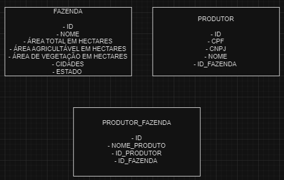

# Brain Agriculture

Esse projeto tem como objetivo resolver de forma prática o desafio proposto pela Verx. O exercício foi resolvido de forma mais prática possível, com isso o tópico final é abordado o tema com foco em melhorias e caminhos alternativos visando um sistema mais "robusto".

O mesmo consiste em um cadastro de produtor rural com os seguintes dados:

1.  CPF ou CNPJ
2.  Nome do produtor
3.  Nome da Fazenda
4.  Cidade
5.  Estado
6.  Área total em hectares da fazenda
7.  Área agricultável em hectares
8.  Área de vegetação em hectares
9.  Culturas plantadas (Soja, Milho, Algodão, Café, Cana de Açucar)

## Requisitos de negócio

- O usuário deverá ter a possibilidade de cadastrar, editar, e excluir produtores rurais.
- O sistema deverá validar CPF e CNPJ digitados incorretamente.
- A soma de área agrícultável e vegetação, não deverá ser maior que a área total da fazenda
- Cada produtor pode plantar mais de uma cultura em sua Fazenda.
- A plataforma deverá ter um Dashboard que exiba:
  - Total de fazendas em quantidade
  - Total de fazendas em hectares (área total)
  - Gráfico de pizza por estado.
  - Gráfico de pizza por cultura.
  - Gráfico de pizza por uso de solo (Área agricultável e vegetação)

## Instalação

Utilizar o docker para rodar o projeto usando os seguintes comandos:

Criar a imagem do banco Postgree:
```shell
docker compose up -d node_db
```
Buildar a imagem da aplicação:
```shell
docker compose build
```
Subir a aplicação em sua máquina:
```shell
docker compose up
```

## Uso

Exemplos simples do uso das rotas da aplicação.

### Exemplo 1: Cadastrar Produtor
```bash
curl --location 'http://localhost:3000/producers' \
--header 'Content-Type: application/json' \
--data '{
    "cpfOrCnpj": "95559808024",
    "name": "João da Silva",
    "farmName": "Fazenda A",
    "city": "Cidade A",
    "state": "SP",
    "totalAreaHectares": 500,
    "cultivableAreaHectares": 300,
    "vegetationAreaHectares": 100,
    "plantedCrops": [
        "Soja",
        "Milho"
    ]
}'
```
```bash
{
    "id": 14,
    "cpfOrCnpj": "95559808024",
    "name": "João da Silva",
    "farmName": "Fazenda A",
    "city": "Cidade A",
    "state": "SP",
    "totalAreaHectares": 500,
    "cultivableAreaHectares": 300,
    "vegetationAreaHectares": 100,
    "plantedCrops": [
        "Soja",
        "Milho"
    ],
    "updatedAt": "2023-12-10T21:15:11.786Z",
    "createdAt": "2023-12-10T21:15:11.786Z"
}
```

### Exemplo 2: Validação CPF/CNPJ
```bash
curl --location 'http://localhost:3000/producers' \
--header 'Content-Type: application/json' \
--data '{
    "cpfOrCnpj": "955598080241111",
    "name": "João da Silva",
    "farmName": "Fazenda A",
    "city": "Cidade A",
    "state": "SP",
    "totalAreaHectares": 500,
    "cultivableAreaHectares": 300,
    "vegetationAreaHectares": 100,
    "plantedCrops": [
        "Soja",
        "Milho"
    ]
}'
```
```bash
{
    "error": "Invalid CPF or CNPJ"
}
```
### Exemplo 3: Validação área agrícultável e vegetação com a fazenda
```bash
curl --location 'http://localhost:3000/producers' \
--header 'Content-Type: application/json' \
--data '{
    "cpfOrCnpj": "955598080241111",
    "name": "João da Silva",
    "farmName": "Fazenda A",
    "city": "Cidade A",
    "state": "SP",
    "totalAreaHectares": 500,
    "cultivableAreaHectares": 300,
    "vegetationAreaHectares": 200.1,
    "plantedCrops": [
        "Soja",
        "Milho"
    ]
}'
```
```bash
{
    "error": "The sum of cultivable area and vegetation cannot be greater than the total area of the farm"
}
```

### Exemplo 4: Mostrar todos os usuários
```bash
curl --location 'http://localhost:3000/producers/'
```
```bash
[
    {
        "id": 14,
        "cpfOrCnpj": "95559808024",
        "name": "João da Silva",
        "farmName": "Fazenda A",
        "city": "Cidade A",
        "state": "SP",
        "totalAreaHectares": 500,
        "cultivableAreaHectares": 300,
        "vegetationAreaHectares": 100,
        "plantedCrops": [
            "Soja",
            "Milho"
        ],
        "createdAt": "2023-12-10T21:15:11.786Z",
        "updatedAt": "2023-12-10T21:15:11.786Z"
    },
    {
        "id": 16,
        "cpfOrCnpj": "91826943030",
        "name": "Maria Oliveira",
        "farmName": "Fazenda B",
        "city": "Cidade B",
        "state": "RJ",
        "totalAreaHectares": 700,
        "cultivableAreaHectares": 400,
        "vegetationAreaHectares": 150,
        "plantedCrops": [
            "Café",
            "Milho",
            "Cana de Açúcar"
        ],
        "createdAt": "2023-12-10T21:22:18.809Z",
        "updatedAt": "2023-12-10T21:22:18.809Z"
    }
]
```
### Exemplo 5: Achar o usuário pelo ID
```bash
curl --location 'http://localhost:3000/producers/14'
```
```bash
{
    "id": 14,
    "cpfOrCnpj": "95559808024",
    "name": "João da Silva",
    "farmName": "Fazenda A",
    "city": "Cidade A",
    "state": "SP",
    "totalAreaHectares": 500,
    "cultivableAreaHectares": 300,
    "vegetationAreaHectares": 100,
    "plantedCrops": [
        "Soja",
        "Milho"
    ],
    "createdAt": "2023-12-10T21:15:11.786Z",
    "updatedAt": "2023-12-10T21:15:11.786Z"
}
```

### Exemplo 6: Update no usuário pelo ID
```bash
curl --location --request PUT 'http://localhost:3000/producers/14' \
--header 'Content-Type: application/json' \
--data '{
    "name": "João da Silva Santos"
}'
```
```bash
{
    "message": "Producer updated successfully",
    "producer": [
        {
            "id": 14,
            "cpfOrCnpj": "95559808024",
            "name": "João da Silva Santos",
            "farmName": "Fazenda A",
            "city": "Cidade A",
            "state": "SP",
            "totalAreaHectares": 500,
            "cultivableAreaHectares": 300,
            "vegetationAreaHectares": 100,
            "plantedCrops": [
                "Soja",
                "Milho"
            ],
            "createdAt": "2023-12-10T21:15:11.786Z",
            "updatedAt": "2023-12-10T21:23:33.982Z"
        }
    ]
}
```

### Exemplo 7: Delete no usuário pelo ID
```bash
curl --location --request DELETE 'http://localhost:3000/producers/14'
```
```bash
{
    "message": "Producer deleted"
}
```

### Exemplo 8: Dashboard
Foram criados alguns usuários para gerar uma massa de teste relevante.

```bash
curl --location 'http://localhost:3000/dashboard'
```
```bash
{
    "totalFarms": 12,
    "farmsByState": [
        {
            "state": "GO",
            "count": "1"
        },
        {
            "state": "PR",
            "count": "1"
        },
        {
            "state": "RS",
            "count": "3"
        },
        {
            "state": "MG",
            "count": "1"
        },
        {
            "state": "SP",
            "count": "2"
        },
        {
            "state": "PA",
            "count": "1"
        },
        {
            "state": "MT",
            "count": "1"
        },
        {
            "state": "BA",
            "count": "1"
        },
        {
            "state": "RJ",
            "count": "1"
        }
    ],
    "totalHectares": 7400,
    "plantedCrops": [
        {
            "cultura": "Uva",
            "quantidade": "1"
        },
        {
            "cultura": "Milho",
            "quantidade": "8"
        },
        {
            "cultura": "Café",
            "quantidade": "5"
        },
        {
            "cultura": "Maçã",
            "quantidade": "1"
        },
        {
            "cultura": "Cana de Açúcar",
            "quantidade": "3"
        },
        {
            "cultura": "Trigo",
            "quantidade": "1"
        },
        {
            "cultura": "Soja",
            "quantidade": "3"
        },
        {
            "cultura": "Algodão",
            "quantidade": "3"
        }
    ],
    "landUse": [
        {
            "totalCultivableArea": 4140,
            "totalVegetationArea": 1550
        }
    ]
}
```

## Melhorias

Validações:
Ao considerar melhorias para este projeto, destaco pontos cruciais relacionados às validações em todas as rotas. Reforçar a quantidade e qualidade das validações é essencial para proteger contra possíveis falhas em regras de negócios e assegurar o controle rigoroso sobre os dados recebidos nos formulários. Para isso pode-se criar funções de validações personalizadas ou até mesmo usar bibliotecas conhecidas como o JOI.

Estrutura de Banco:
Uma aprimoramento fundamental reside na normalização do banco de dados, visando tornar sua manutenção mais prática no futuro. Os benefícios incluem:

- Redução da redundância de dados: Armazenamento eficiente, evitando repetição de informações em diversas tabelas.

- Facilidade de manutenção: Atualizações, como as relacionadas a uma fazenda, podem ser realizadas em uma única tabela.

- Melhor suporte a consultas complexas: A estrutura normalizada facilita consultas eficientes e a obtenção de informações específicas.

Propõe-se a criação de tabelas distintas para Produtores (contendo apenas informações relevantes a eles), Fazendas (com dados específicos a elas) e uma tabela de ligação entre Produtores e Fazendas, onde se registra a relação, incluindo os produtos associados (se aplicável).



Parâmetros:
Introduzir elementos de parâmetros, como query strings em muitas rotas, seria benéfico para aprimorar a usabilidade e ampliar as possibilidades em cada funcionalidade. Possibilitaria também novas funcionalidades para os gráficos, necessitando somente passagens de parâmetros pelo front-end (como período de tempo, produtos específicos, estados específicos, etc).

Velocidade:
Considerando o contexto da aplicação, avaliar locais e cenários propícios para a utilização de informações em cache pode resultar em melhorias significativas no tempo de execução de funcionalidades que demandam consultas ao banco de dados. Isso pode ser uma estratégia eficaz para otimizar o desempenho em determinadas situações.

